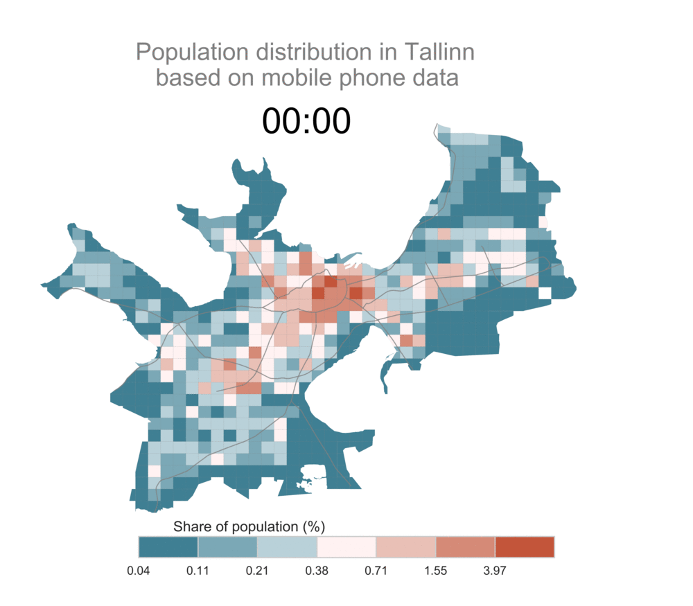

# DYNAMO
Repository for all the source codes for the analyses done in manuscript "Dynamic cities: Accessibility as a function of time."

## Hourly population distribution in Tallinn, Estonia (24h)

